---

# REST API Client – Python (Requests Library)

## 📌 Overview

This project is a command-line based REST API client built using Python and the `requests` library.
It demonstrates how a real-world API consumer interacts with RESTful services by performing CRUD
operations on resources.

The application communicates with the public **JSONPlaceholder API** and follows clean architecture,
robust error handling, and professional project structuring practices.

---

## 🎯 Objectives

* Send HTTP requests (GET, POST, PUT, DELETE)
* Work with headers and JSON payloads
* Simulate secure API key handling
* Interpret HTTP response codes
* Implement robust error handling
* Test APIs using Postman
* Follow a clean, modular project structure

---

## 🧰 Technologies Used

* Python 3.x
* `requests` library
* JSONPlaceholder (Public REST API)
* Postman (API testing)

---

## 📁 Project Structure

```
rest-api-client-python/
│
├── api_client/
│   ├── config.py        # API base URL and headers
│   ├── client.py        # HTTP request handling
│   ├── services.py      # Business logic
│   ├── exceptions.py    # Custom exceptions
│   └── main.py          # CLI entry point
│
├── screenshots/         # Postman testing screenshots
├── requirements.txt
├── .gitignore
└── README.md
```

---

## 🚀 Getting Started

### Installation

```bash
pip install -r requirements.txt
```

### Run Application

```bash
python api_client/main.py
```

---

## 🔒 API Details

* **Base URL:** [https://jsonplaceholder.typicode.com](https://jsonplaceholder.typicode.com)
* **Resource:** `/posts`

---

## 🧪 Task 1 – Postman Testing (HTTP Requests)

All HTTP endpoints implemented in **Task 1 (HTTP Requests Handling)** were manually tested using **Postman** to validate request methods, headers, payloads, and response codes.

### Tested Endpoints

* GET `/posts`
* GET `/posts/{id}`
* POST `/posts`
* PUT `/posts/{id}`
* DELETE `/posts/{id}`

### Headers Used

* `Content-Type: application/json`

### Observed Status Codes

| HTTP Method | Status Code |
| ----------- | ----------- |
| GET         | 200 OK      |
| POST        | 201 Created |
| PUT         | 200 OK      |
| DELETE      | 200 OK      |

### Comparison with Python Output

The responses received in Postman matched the outputs produced by the Python API client,
including server-generated IDs returned for POST requests.

### Screenshots

* **GET All Posts**
  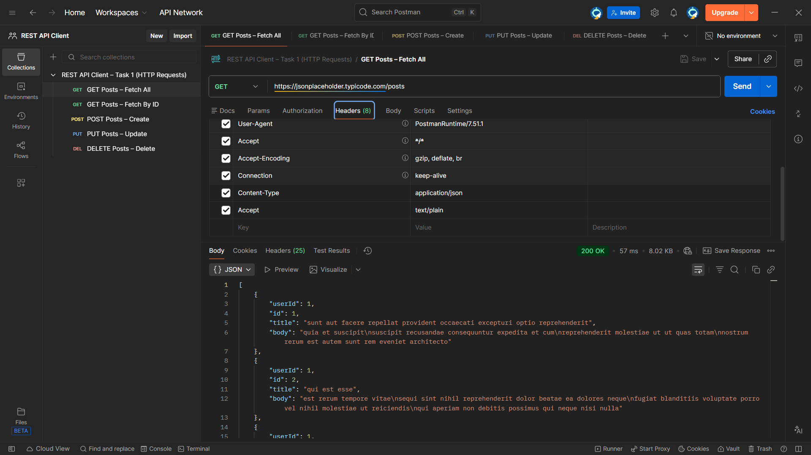

* **GET Post by ID**
  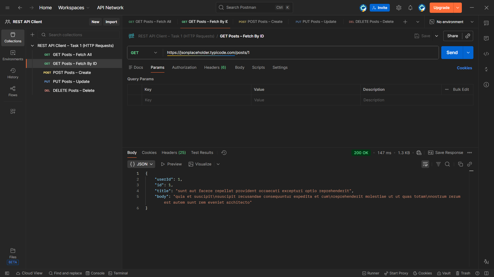

* **POST Create Post**
  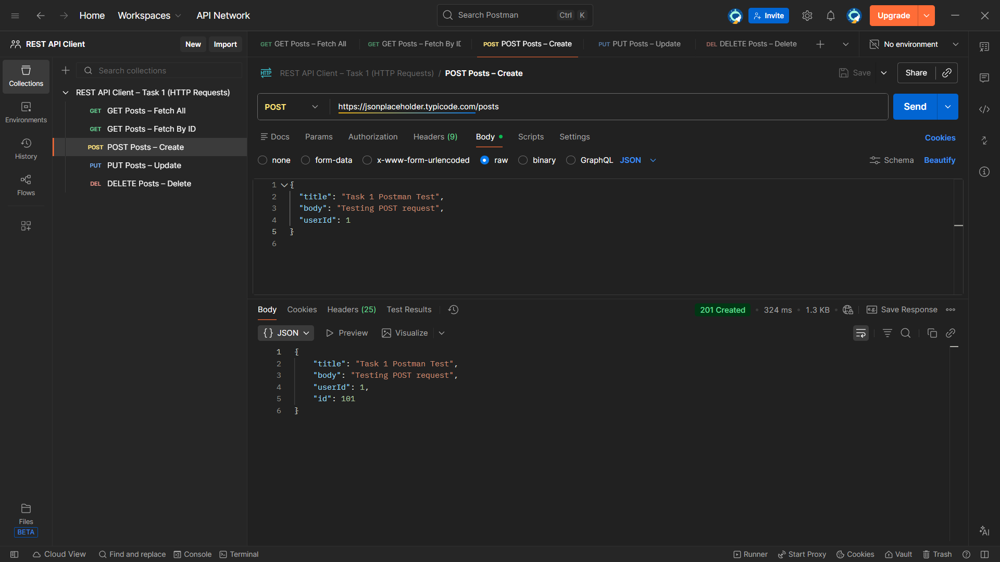

* **PUT Update Post**
  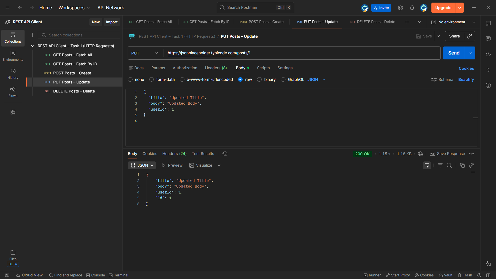

* **DELETE Post**
  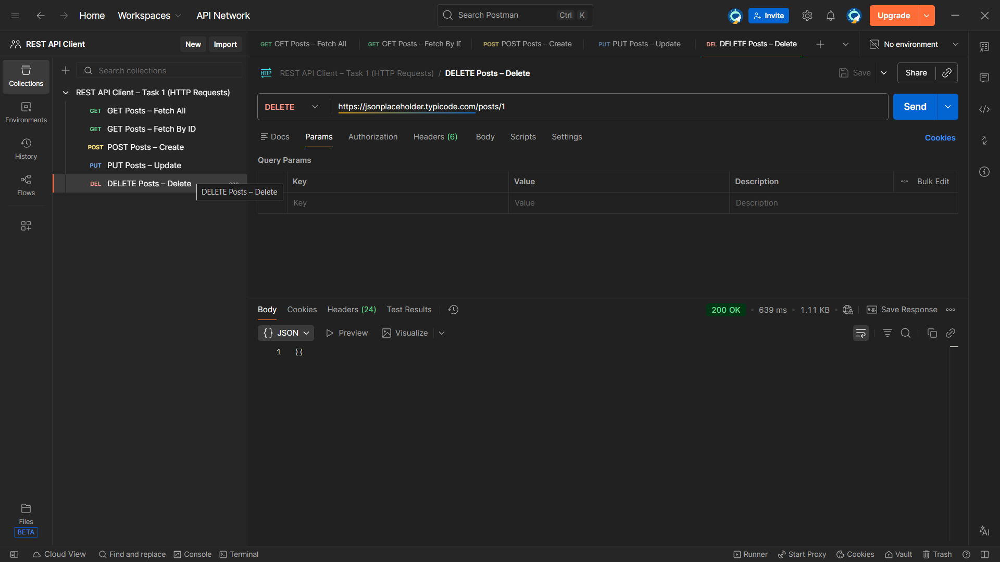

## 🔐 Task 2 – Headers & API Key Handling

The application simulates API key–based authentication to reflect real-world REST API consumption.

### Implementation Details
- API key is defined centrally in `config.py`
- The key is injected into requests via the `Authorization` header
- Business logic does not directly reference or hardcode the API key

### Headers Used
- `Content-Type: application/json`
- `Authorization: Bearer <API_KEY>`

### Notes
JSONPlaceholder does not require authentication; however, this simulation follows industry best practices for secure API access.

## 📦 Task 3 – JSON Request & Response Handling (Postman)

Postman was used to validate JSON request payloads and inspect API responses for Task 3.

### Validations Performed
- Verified correct JSON structure for POST and PUT requests
- Confirmed required fields (`title`, `body`, `userId`) in request payloads
- Inspected API responses to understand response structure

### Notes on Validation
Although JSONPlaceholder accepts empty fields, input validation is enforced in the Python services layer before API requests are sent.

### Screenshots
- POST – Valid JSON Payload  
  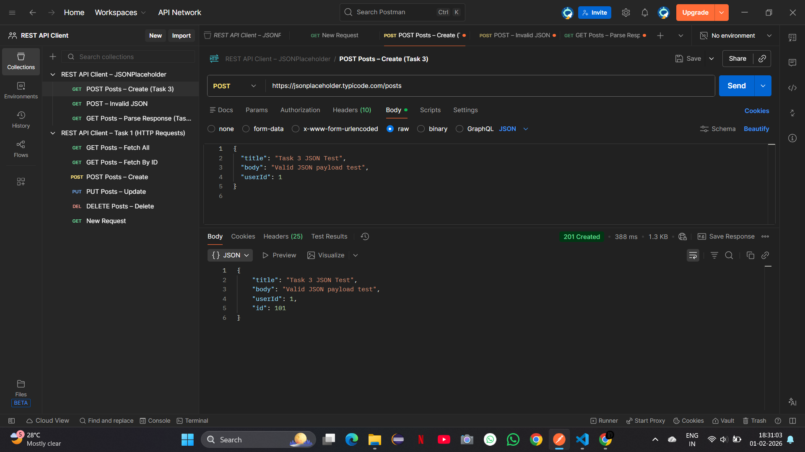

- POST – Invalid JSON Payload  
  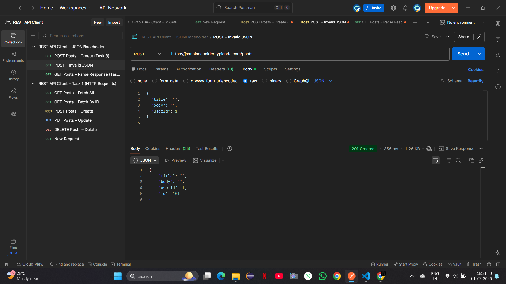

- GET – Response Parsing  
  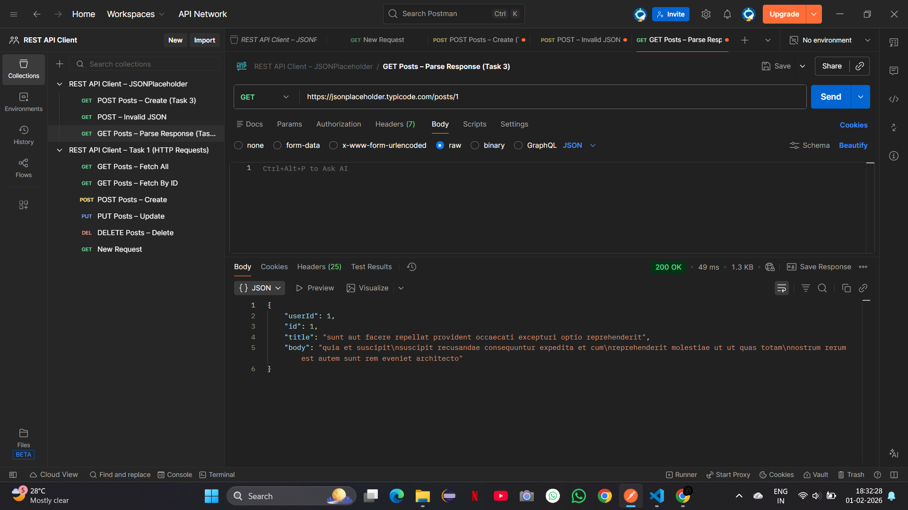

---

## 📝 Notes

* JSONPlaceholder is a **fake API** used for testing and learning.
* POST, PUT, and DELETE operations **do not persist data** on the server.
* API behavior simulates real-world REST APIs.

## 🚦 Task 4 – HTTP Response Codes & Error Handling (Postman)

Postman was used to inspect HTTP response codes and validate API behavior.

### Tested Scenarios
- 200 OK – Successful GET request
- 201 Created – Successful POST request
- 404 Not Found – Invalid resource ID
- 400 Bad Request – Conceptual validation case

### Notes
JSONPlaceholder does not strictly enforce validation errors.  
Client-side validation and error handling are implemented in Python.

### Screenshots
- GET 200 OK  
  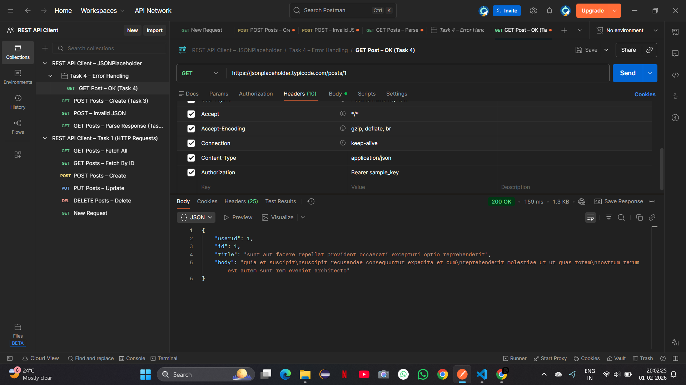

- GET 404 Not Found  
  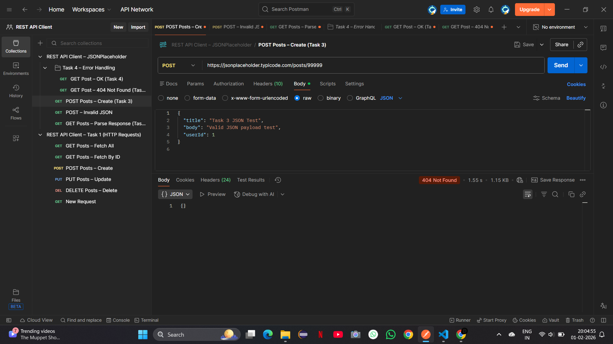

- POST 201 Created  
  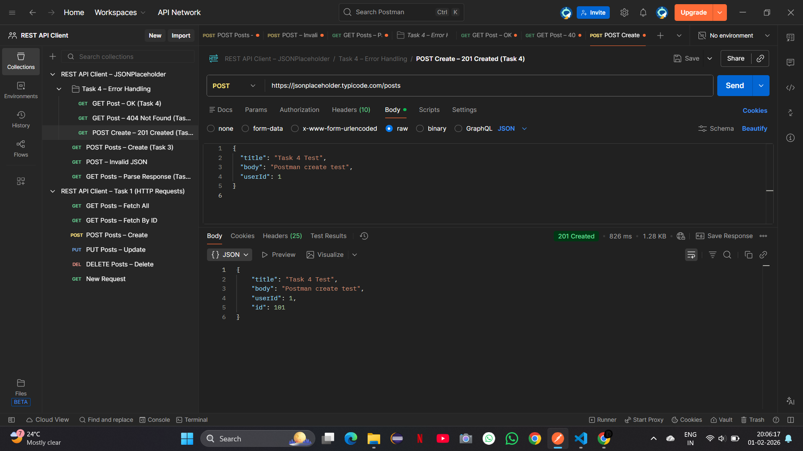

## 🛡️ Task 5 – Advanced Error Handling

Task 5 focuses on making the application resilient by handling all failure scenarios gracefully,
ensuring the program never crashes due to user mistakes, network issues, or unexpected API behavior.

### Handled Error Scenarios

- **Network failures**  
  Gracefully handled when the API is unreachable or internet connectivity is lost.

- **Connection timeouts**  
  Requests that exceed the configured timeout return a friendly timeout message.

- **Invalid user input**  
  Non-numeric IDs and invalid inputs are validated at the CLI level.

- **Unexpected server responses**  
  Unknown or unsupported HTTP status codes are safely handled without crashing.

- **Invalid HTTP methods / Unsupported endpoints**  
  Unsupported operations such as `DELETE /posts` are handled gracefully.

### Notes on API Behavior

JSONPlaceholder is a mock API and does not consistently return `405 Method Not Allowed`.
For unsupported HTTP methods, it returns `404 Not Found` instead.
The application handles both cases gracefully and displays a user-friendly message.

### Postman Validation

- Invalid HTTP Method / Unsupported Endpoint  
  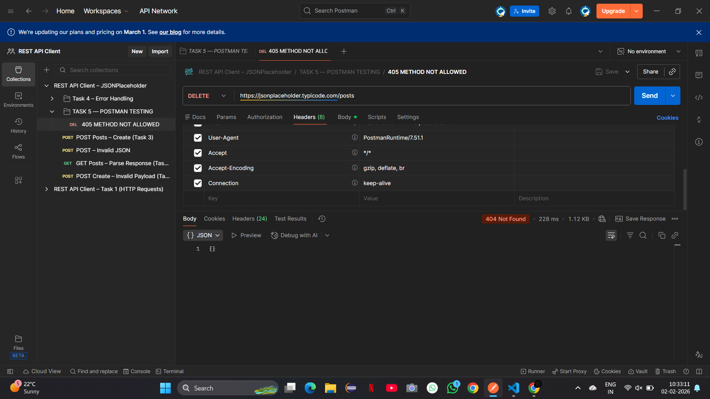

---

## ✅ Status

* ✔ Task 1 – HTTP Requests Handling **Completed**
* ✔ Task 2 – Headers & API Key Handling (Completed)
* ✔ Task 3 – JSON Request & Response Handling (Completed)
* ✔ Task 4 – HTTP Response Codes Handling (Completed)
* 🔄 Next: 5 - Error Handling
---

## 💡 Final Result

This project demonstrates how a Python-based REST API client interacts with third-party APIs using
industry-standard practices and tools.

---
